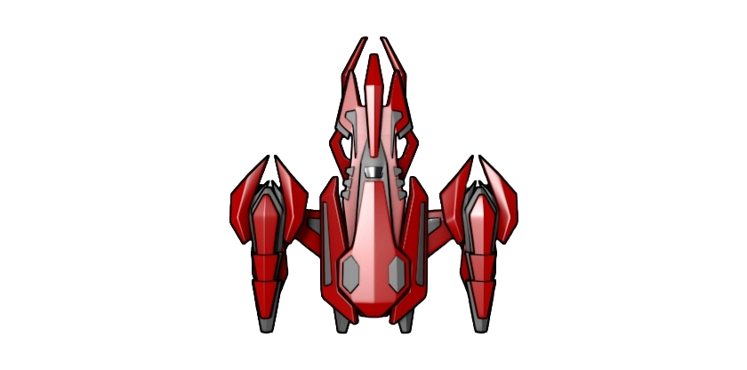
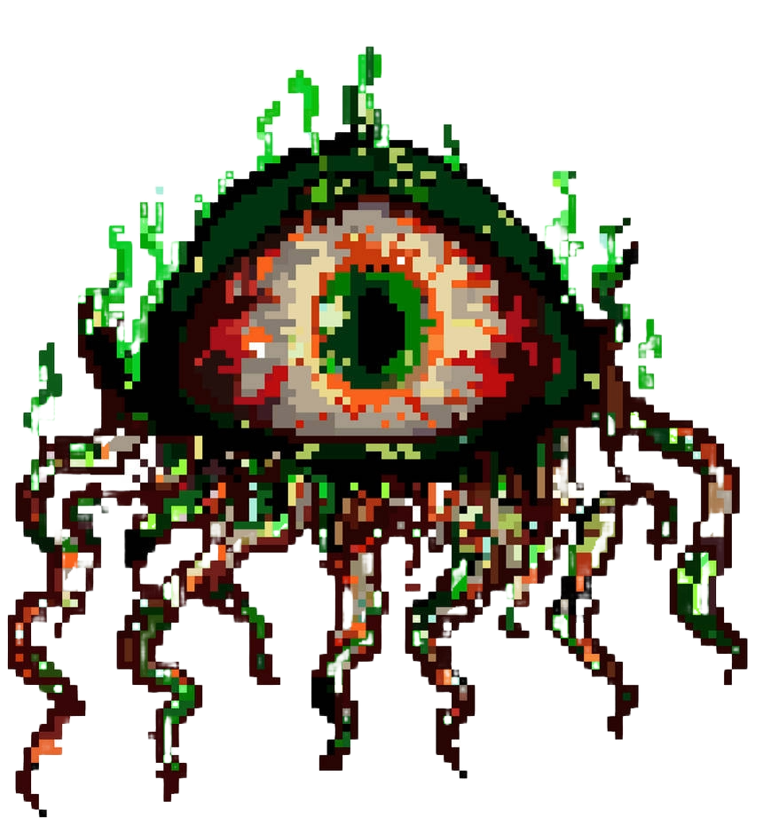

# 🚀 Asteroid Destroyer!!

A fast-paced, arcade-style **2D shooter game** built with **Python** and **Pygame**, where you pilot a spaceship to blast down incoming asteroids and defeat alien bosses! Test your reflexes, climb the scoreboard, and survive as long as you can.

<div align="center">
  
  
  
</div>

---

## 🎮 Features

- 🔫 **Spaceship Controls:** Smooth movement in all directions using `WASD` keys.
- 💥 **Shooting Mechanics:** Shoot bullets with a mouse click to destroy asteroids and alien bosses.
- ☄️ **Random Asteroid Spawning:** Increasing speed and density as score goes up.
- 👾 **Alien Boss Appearances:** Alien appears every 500 points with its own laser attack.
- 📈 **Dynamic Difficulty:** Asteroids get faster and spawn more frequently as your score increases.
- ⏸️ **Pause Menu:** Pause the game anytime using `P`.
- 🏆 **High Score Tracking:** Persistent high score saved in `highscore.txt`.
- 🎵 **Background Music and SFX:** Dynamic music system that switches between space and alien themes. All actions have SFX feedback.
- 🖱️ **Main Menu & Game Over Screen:** Interactive buttons for starting, replaying, or quitting the game.
- ⚙️ **FPS Settings:** Choose between 60 FPS or 144 FPS for optimal performance.

---

## 🧰 Built With

| Component     | Library / Tool        |
|---------------|------------------------|
| Core Engine   | [Pygame](https://www.pygame.org/) |
| Graphics      | PNG assets via `pygame.image.load()` |
| Sound         | `.wav` and `.mp3` with `pygame.mixer` |
| Fonts         | Custom font via `.ttf` |
| Persistent Storage | File I/O in `highscore.txt` |

---

## 🚀 Controls

| Action           | Key / Input      |
|------------------|------------------|
| Move Left        | `A`              |
| Move Right       | `D`              |
| Move Up          | `W`              |
| Move Down        | `S`              |
| Shoot            | Left Click       |
| Pause / Resume   | `P`              |
| Navigate Menus   | Mouse Click      |

---

## 🖼️ Screenshots


> `)`  
> `)`  
> `)`
> ``

---

## 📁 Project Structure

```
Asteroid_Destroyer/
│
├── main.py               # Main game loop and logic
├── highscore.txt         # Stores high score
├── Assets/
│   ├── Images/           # All PNGs: ship, asteroid, alien, buttons, etc.
│   ├── Fonts/            # Custom .ttf font
│   └── SFX/              # Background music & sound effects
```


---

## 🛠️ Setup Instructions

1. **Install Pygame** (if not already):
   ```bash
   pip install pygame
2. **Clone the repo and run**:
   ```bash
   python main.py

|**Make sure the working directory contains the Assets folder with correct structure and media folder!!**


## 🙌 Credits
- Game developed by Sabyasachi Mukhopadhyay
